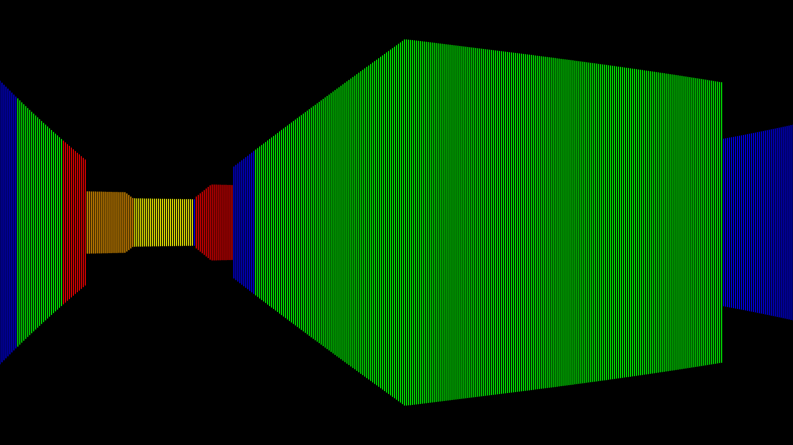
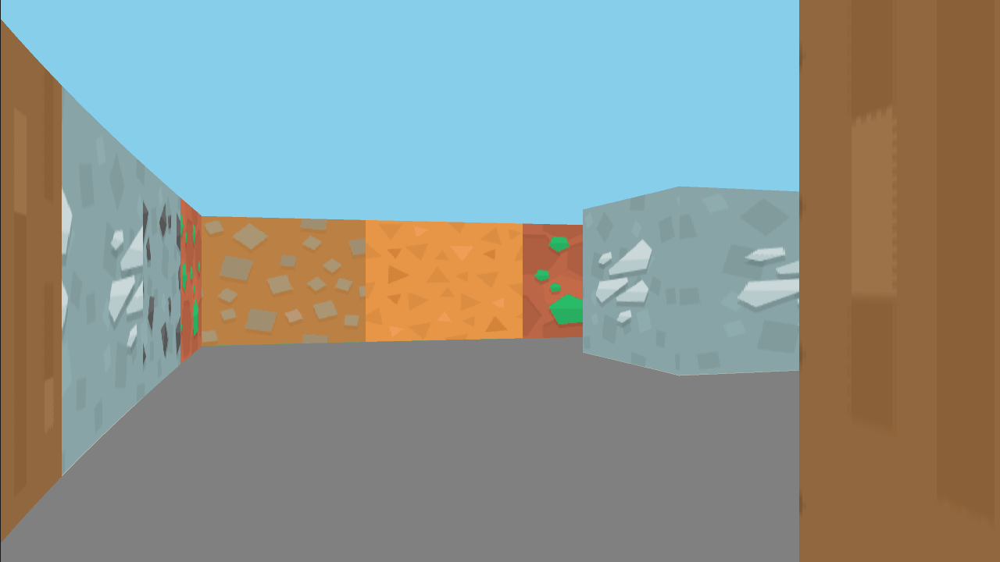
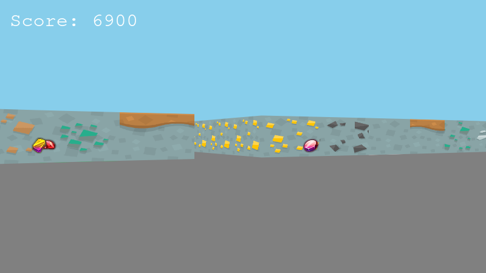

# Project Progression
This file tracks the progress of this project as it has grown

## v0.1

_"This is so Windows 95!" - Denise Deng_

## v0.2

Texture mapping was added, though their are some visual oddities with regard to texture positioning.

## v0.3
;
Sprite rendering and a score display are added.